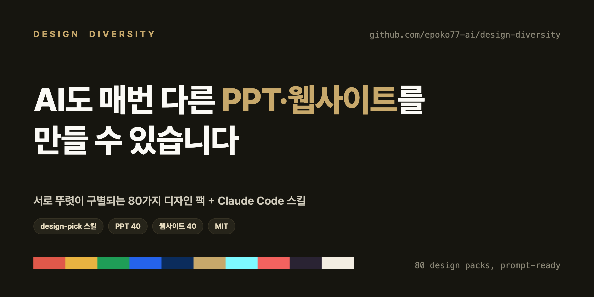

# Design Diversity



> AI에게 PPT·웹사이트를 맡기면 결과물이 늘 비슷합니다. **design-pick 스킬**을 설치하면,
> 서로 뚜렷이 구별되는 **100가지 디자인 스타일** 중 하나를 골라 Claude가 그 스타일대로 만들어 줍니다.

🌐 **카탈로그 둘러보기:** https://design-diversity.vercel.app

## 왜

생성형 AI에게 "PPT 만들어줘", "랜딩페이지 만들어줘"라고 하면 결과물이 서로 닮습니다 — 같은
그라디언트, 같은 둥근 카드, 같은 산세리프. 모델이 "안전한 평균"으로 수렴하기 때문입니다.
문제는 AI의 한계가 아니라 "어떤 디자인으로"를 알려주지 않은 것뿐입니다.

## 무엇 — `design-pick` 스킬

`skills/design-pick/`는 Claude Code용 **소비자 스킬**입니다. 설치하면:

- "고급스러운 다크 톤으로 발표자료 만들어줘"처럼 **느낌만 말하면** 어울리는 팩 2~3개를 추천하고,
- 팩 **슬러그를 직접 지정**하면(예: `web-velvet-dark-boutique`) 그 팩으로 바로 생성하고,
- 고른 팩의 정밀 명세(색·타이포·레이아웃·차트·다이어그램·"하지 말 것")를 그대로 적용합니다.

100개 팩(PPT 50 + 웹 50, 이 중 20개는 5~7개 상세 페이지를 갖춘 프리미엄 팩)의 명세가 스킬 안에 `references/`로 번들돼 있어, 설치 후엔 네트워크
없이 동작합니다.

## 설치

```bash
# Claude Code 프로젝트에 설치
cp -r skills/design-pick YOUR_PROJECT/.claude/skills/
# 또는 전역 설치
cp -r skills/design-pick ~/.claude/skills/
```

## 쓰는 법

1. **둘러보고 고르기 (시각적)** — [카탈로그 사이트](https://design-diversity.vercel.app)에서 100팩의
   미리보기를 보고 마음에 드는 팩의 슬러그를 확인합니다.
2. **Claude Code에서 적용** — 스킬이 설치된 상태에서 이렇게 요청합니다:

   > `design-pick` 스킬로 **web-velvet-dark-boutique** 팩을 적용해서 *제품 소개* 웹사이트를 만들어줘

3. **또는 느낌만 말하기** — "전문적인 컨설팅 느낌 PPT 만들어줘"라고 하면 스킬이 후보를 추천합니다.

### 스킬 없이 — Claude.ai 채팅에 붙여넣기

Claude Code가 없어도 됩니다. 팩 상세 페이지에서 `prompt.md` 전문을 복사해, 원본 자료(기획서·
강의안·제품 소개 등)와 함께 **[claude.ai](https://claude.ai) 채팅에 그대로 붙여넣고** 이렇게 요청하세요:

> 위 디자인 명세 그대로, **편집 가능한 네이티브 `.pptx`** 로 발표자료를 만들어줘
> (웹은: 위 디자인 명세 그대로, HTML/CSS로 [내 주제] 페이지를 만들어줘)

Claude.ai 가 `.pptx`/HTML 파일을 직접 생성해 다운로드로 줍니다. PPT는 슬라이드를 통째 PNG로
박지 않도록, 문구에 "**편집 가능한 네이티브 `.pptx`**"를 그대로 넣는 것이 중요합니다.

## 출력 사양 — PPT는 편집 가능한 네이티브 .pptx

이 카탈로그의 PPT 팩으로 만들어지는 슬라이드는 **모두 편집 가능한 PowerPoint
네이티브 객체**입니다. 사용자가 파워포인트에서 그대로 글자·색·도형을 수정·재배치할
수 있어야 한다는 것이 카탈로그의 출력 규칙입니다.

- **네이티브** — 제목·본문·표·불릿·도형·화살표가 모두 python-pptx 네이티브
  객체(텍스트박스·표·오토셰이프·연결선·차트). 차트·다이어그램·인포그래픽도 가능한 한
  네이티브 도형으로 그립니다.
- **풀블리드 PNG 금지** — HTML/CSS 로 렌더한 뒤 슬라이드를 통째로 PNG 이미지 한
  장으로 박는 방식은 사용하지 않습니다. 텍스트가 비트맵으로 굳어 수정 불가가 되기
  때문입니다.
- **이미지 임베드는 보조 자산만** — 사진·일러스트·로고 같은 비주얼 자산은 슬라이드
  위에 이미지로 얹지만, 텍스트·차트는 그 위에 별도 네이티브 레이어로 올립니다.
- **폰트** — 본문 한글 + 영문 라벨 글꼴은 임베딩 권고. 받는 사람의 PC에 폰트가
  없어도 디자인이 깨지지 않습니다.

이 규칙은 `skills/design-pick/SKILL.md` 와 각 팩의 `prompt.md` 양쪽에 명시돼 있어,
스킬을 통해서든 Claude.ai 에 명세를 붙여 쓰든 동일하게 적용됩니다.

## 저장소 구성

| 경로 | 내용 |
| --- | --- |
| `skills/design-pick/` | **소비자 스킬** — 설치해서 쓰는 본체. SKILL.md + 100팩 명세 references. |
| `design-packs/` | 100팩 원본 자산 — 각 폴더에 `prompt.md`·`tokens.json`·`preview.png`·`meta.yaml`. |
| `catalog.json` | 100팩 머신리더블 인덱스 (schema v2 — `category`/`pages` 포함). |
| `site/` | Next.js 15 카탈로그 웹사이트(둘러보기·picker). |
| `.claude/` | 이 카탈로그를 **만든** 빌드 하네스(에이전트 7 + 스킬 8). "어떻게 만들었나" 아카이브. |

각 팩은 5개 스타일 축으로 분류됩니다: **color · type · layout · space · motion**.

## 카탈로그 사이트 빌드

```bash
cd site && npm install && npm run build
```

## 기여

새 팩 추가는 [CONTRIBUTING.md](./CONTRIBUTING.md) 참고.

## 라이선스

디자인 명세(`prompt.md`)·토큰(`tokens.json`)·문서·스킬은 [MIT](./LICENSE). 각 팩은 공개 디자인
시스템·스타일에서 학습한 **시각 원리의 명세**이며 특정 제품의 상표·로고·독점 자산을 재배포하지
않습니다. 학습 출처는 각 팩 `meta.yaml`에 기재.
